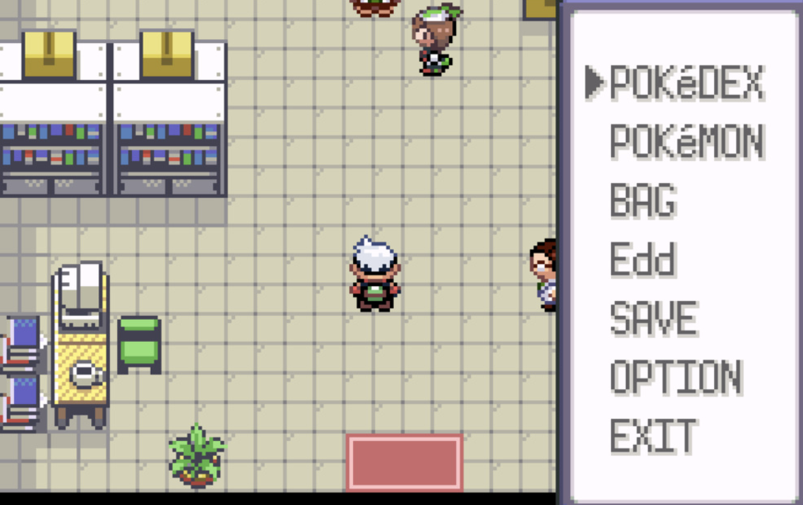

# Retro JRPG UI Redesign

Visual retheme of Agent Valley to match a late GBA / early DS-era retro handheld JRPG aesthetic. No behavior, interaction, or animation changes — purely visual.

## Visual Reference



Key takeaways from this reference:
- Floor tiles are very light (near-white cream/pink) with subtle grid contrast
- Menu panel uses thick dark outer border, white interior, dark text — classic RPG menu box
- Furniture is simple colored blocks against the light floor, low saturation
- Characters are the most saturated, highest-contrast elements in the scene
- Walls barely contrast with floors — the environment reads as one calm, light surface
- Large open empty space is a feature, not a problem

## Decisions

- **Scope:** Full redesign — environment surfaces, UI chrome, agents, props, presentation screen
- **Approach:** Extract theme object first (pure refactor), then apply new palette (Approach B)
- **Typography:** System monospace (Courier New) — no external pixel font. Sell retro feel through sizing, spacing, uppercase
- **Interactions:** All behavior stays the same — 62s loop, hover popups, agent tabs, chat panel
- **Color philosophy:** Warm cream environment (#E6E0CC range), cool gray UI chrome (#ECE9EA range), agents remain saturated as focal points

## Theme Extraction (Phase 1)

Create `apps/web/src/theme.ts` exporting a single theme object:

```
theme
├── colors
│   ├── environment
│   │   ├── floorA, floorB (warm cream checkerboard)
│   │   ├── wall, wallDark, trim
│   │   ├── carpetA, carpetB
│   │   ├── kitchenTileA, kitchenTileB
│   │   ├── desk, deskTop
│   │   ├── monitor, monitorGlow
│   │   ├── board, boardStroke
│   │   ├── glass, shadow
│   │   ├── leaf (plant green)
│   │   └── void (between-room background)
│   ├── ui
│   │   ├── panelBg (main panel background)
│   │   ├── panelSecondary (secondary panel tone)
│   │   ├── borderOuter (dark outer border)
│   │   ├── borderInner (medium inner border)
│   │   ├── deepOutline (deep outline color)
│   │   ├── shellA, shellB (shell tiling)
│   │   └── shellOverlay (shell darkening overlay)
│   ├── accent
│   │   ├── green (muted, for status/interactive)
│   │   ├── red (soft, for buttons/alerts)
│   │   ├── blue (dusty, for links/info)
│   │   └── gold (warm, for highlights/active)
│   └── text
│       ├── primary (dark ink on light panels)
│       ├── secondary (medium tone for less emphasis)
│       ├── status.active (muted green)
│       ├── status.waiting (warm gold)
│       └── onDark (for rare dark-bg contexts like monitors)
├── textStyles (all TextStyleOptions, referencing colors above)
└── panel
    ├── outerBorderWidth
    ├── innerBorderWidth
    └── structure: dark outer → medium inner → light fill (no accent stripes)
```

Phase 1 extracts the CURRENT values into this structure. App must look identical after extraction.

## New Palette (Phase 2)

### Environment Colors

| Surface | Current | New | Hex |
|---------|---------|-----|-----|
| Open Desks floor A | #B78B5B | warm cream | #E6E0CC |
| Open Desks floor B | #C69A67 | soft beige | #D9D1B8 |
| Boardroom carpet A | #617C63 | muted sand | #C8C0A6 |
| Boardroom carpet B | #78916D | soft beige | #D9D1B8 |
| Dev Sync floor A | #7C786B | soft beige | #D9D1B8 |
| Dev Sync floor B | #898377 | muted sand | #C8C0A6 |
| Kitchen tile A | #D8D3BD | warm cream | #E6E0CC |
| Kitchen tile B | #CFC6AA | secondary panel | #D8D4D6 |
| Game Room floor A | #695E86 | muted sand | #C8C0A6 |
| Game Room floor B | #746797 | darker sand | #B8AF96 |
| Wall | #3D2F28 | medium gray | #6D6B73 |
| Wall dark | #231A18 | deep outline | #4E4B55 |
| Trim | #6A5947 | secondary border | #8B8892 |
| Void (between rooms) | #101614 | darker sand | #B8AF96 |

### UI Chrome Colors

| Element | Current | New | Hex |
|---------|---------|-----|-----|
| Panel fill | #1A365D | panel bg | #ECE9EA |
| Secondary panel | #0D1627 | secondary panel | #D8D4D6 |
| Shell tile A | #172D46 | secondary panel | #D8D4D6 |
| Shell tile B | #1C3852 | panel bg | #ECE9EA |
| Shell overlay | #061526 | — | removed or very subtle |
| Panel outer border | cream #F7E6A8 | deep outline | #4E4B55 |
| Panel inner border | — | inner border | #8B8892 |
| Panel interior | shade fill | panel bg | #ECE9EA |

### drawPixelPanel New Structure

Old: dark outer → cream paper → shade fill → accent stripe top → dark stripe bottom/sides
New: deep outline outer (#4E4B55) → inner border (#8B8892) → panel bg fill (#ECE9EA)

No accent stripes. Layered border IS the decoration.

### Text Color Flip

| Context | Current | New |
|---------|---------|-----|
| UI titles/body | #FFF2CF (cream on dark) | #4E4B55 (dark on light) |
| TASK RUNNING | #8EF7A6 (neon green) | #7FA06B (muted green) |
| WAITING | #FFD37B (gold) | #D8B663 (warm gold) |
| Tab active | #FFD37B fill | #D8B663 fill |
| Tab inactive | #2F6FAB / #314053 | #D8D4D6 / #B8AF96 |
| Button (VIEW MORE) | #D4494C | #C97B7B (soft red) |
| Bubble fill | #FFF7DB | #ECE9EA |
| Bubble stroke | #3A2A24 | #6D6B73 |

### Accent Colors (Used Sparingly)

| Accent | Hex | Usage |
|--------|-----|-------|
| Muted green | #7FA06B | Status active, monitor glow, whiteboard marks |
| Soft red | #C97B7B | Buttons, alerts, book accents |
| Dusty blue | #6D86A8 | Monitor glow, info elements |
| Warm gold | #D8B663 | Active highlights, waiting status |

### Furniture Wood Tones

| Element | Current | New | Hex |
|---------|---------|-----|-----|
| Desk base | #8F5B3E | desaturated sand | #B8AF96 |
| Desk top | #B9794D | lighter sand | #C8C0A6 |
| Table base | #72543D / #8F5B3E | desaturated sand | #B8AF96 |
| Table top | #A86F48 / #B9794D | lighter sand | #C8C0A6 |
| Table legs | #4A3022 / #563B2D | deep outline | #4E4B55 |
| Chair legs | #342820 | deep outline | #4E4B55 |
| Bookshelf frame | #5E3C2B | border inner | #8B8892 |
| Bookshelf shelves | #2E211C | deep outline | #4E4B55 |
| Coffee table | #83543A / #A66F49 | #B8AF96 / #C8C0A6 | — |
| Couch legs | #342820 | deep outline | #4E4B55 |
| Pot (plants) | #A35E3F / #C46D49 | #B8AF96 / #C8C0A6 | — |
| Notice board frame | #5E3C2B | #8B8892 | — |
| Notice board cork | #CEAD75 | #D9D1B8 | — |

### Agent Sprites

Agent palettes (hair, skin, shirt, pants, accent) stay UNCHANGED. They are the most saturated elements — intentional focal points against the muted background.

Agent detail changes:
- Eyes: #282F2C → #4E4B55
- Shoes: #1D1A18 → #4E4B55
- Shadow: #221B16 at 0.28 → #4E4B55 at 0.20
- Name stroke: #241813 → #B8AF96

### Furniture & Props

- Bookshelf wood: desaturated to #8B8892 range
- Book colors: use the four spec accents instead of bright primaries
- Plants: leaves → #7FA06B, pot stays muted terracotta
- Water cooler: gray tones from panel palette
- Chairs: desaturated to blend with rooms
- Monitor glow: #6D86A8 (dusty blue) and #7FA06B (muted green) replacing cyan/neon
- Monitor shells stay dark as deliberate contrast

### Presentation Screen

- Background: #111C1D → #B8AF96 (sand)
- Tile floor: warm cream tones
- Card/panel fills: use panel palette (light backgrounds, dark text)
- Progress bar: accent colors on light background
- Text: flips to dark on light

## Files Changed

1. **`apps/web/src/theme.ts`** — NEW. Full theme object with all colors, text styles, panel config
2. **`apps/web/src/office-world.ts`** — Import theme, replace all inline hex values
3. **`apps/web/src/styles.css`** — Background color update
4. **`apps/web/src/main.ts`** — App background color update

## Testing

- Run dev server after Phase 1: verify zero visual diff (pure refactor)
- Run dev server after Phase 2: verify full 62-second loop
  - All five rooms render correctly with new floor/wall colors
  - Agent sprites visible and properly contrasted against light floors
  - Chat panel readable (dark text on light panels)
  - Tab switching works, active/inactive states visually distinct
  - Hover popups render with RPG menu borders
  - Presentation screen renders with flipped color scheme
  - Monitor glows animate with new muted colors
  - Thought bubbles readable
